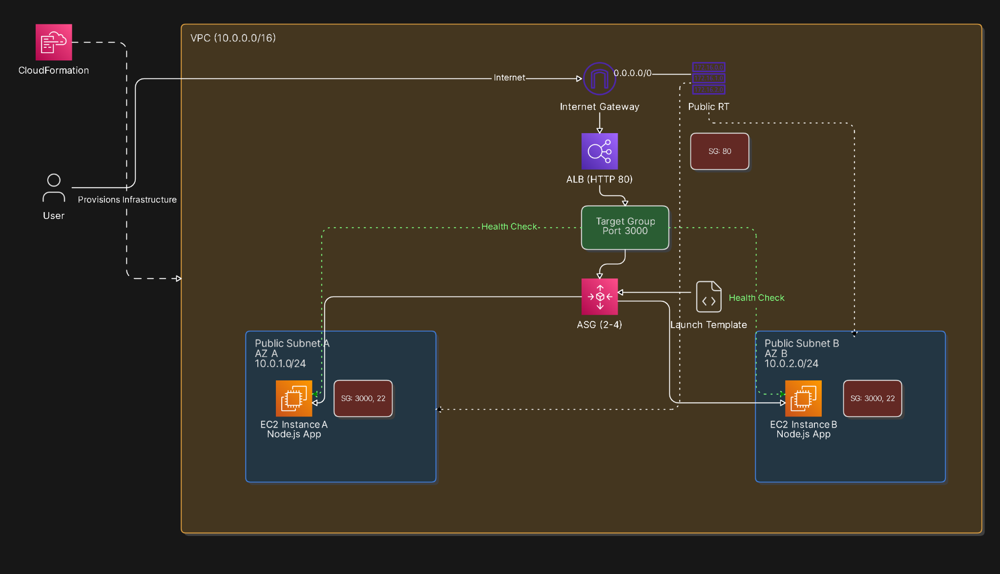

# AWS Node.js High Availability Infrastructure

## Overview

This project deploys a highly available Node.js application on AWS using CloudFormation.

### Services Used

- Amazon VPC
- Amazon EC2
- Application Load Balancer (ALB)
- Auto Scaling Group (ASG)
- AWS CloudFormation

### Features

- Multi-AZ deployment
- Automatic load balancing
- Auto Scaling
- Health monitoring
- Infrastructure as Code

## Architecture Diagram

## Deployment

1. Create an EC2 Key Pair.
2. Upload infrastructure.yaml to AWS CloudFormation.
3. Provide the Key Pair name.
4. Create the stack.
5. Wait for CREATE_COMPLETE status.
6. Access the application using the ALB DNS name from CloudFormation Outputs.

### Sample Application

https://github.com/johnpapa/node-hello

